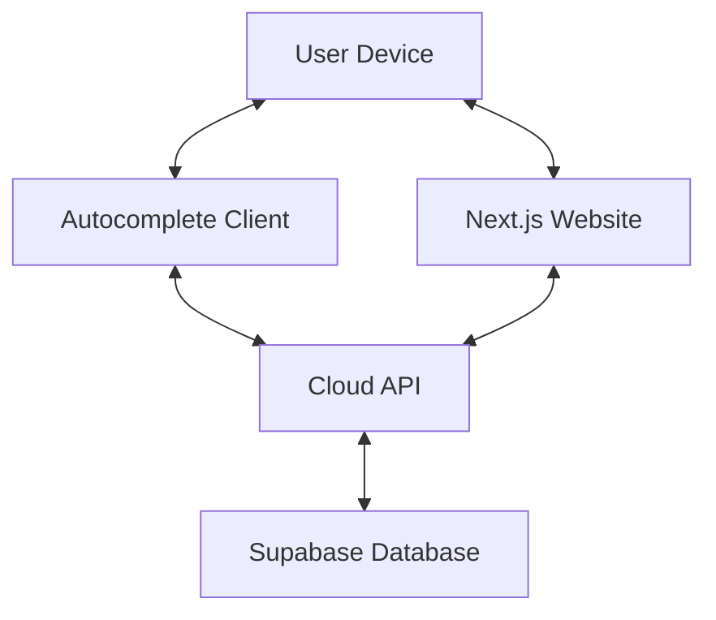
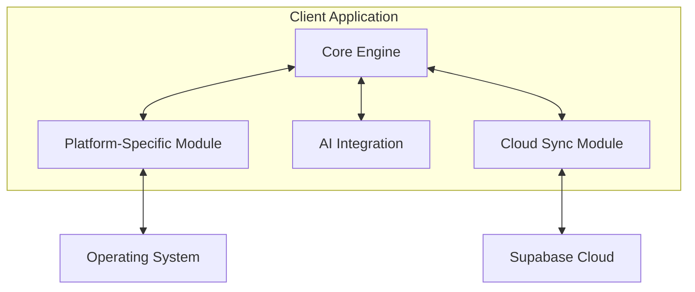
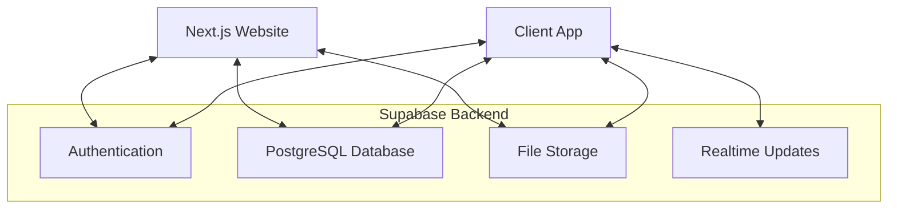
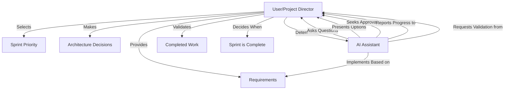
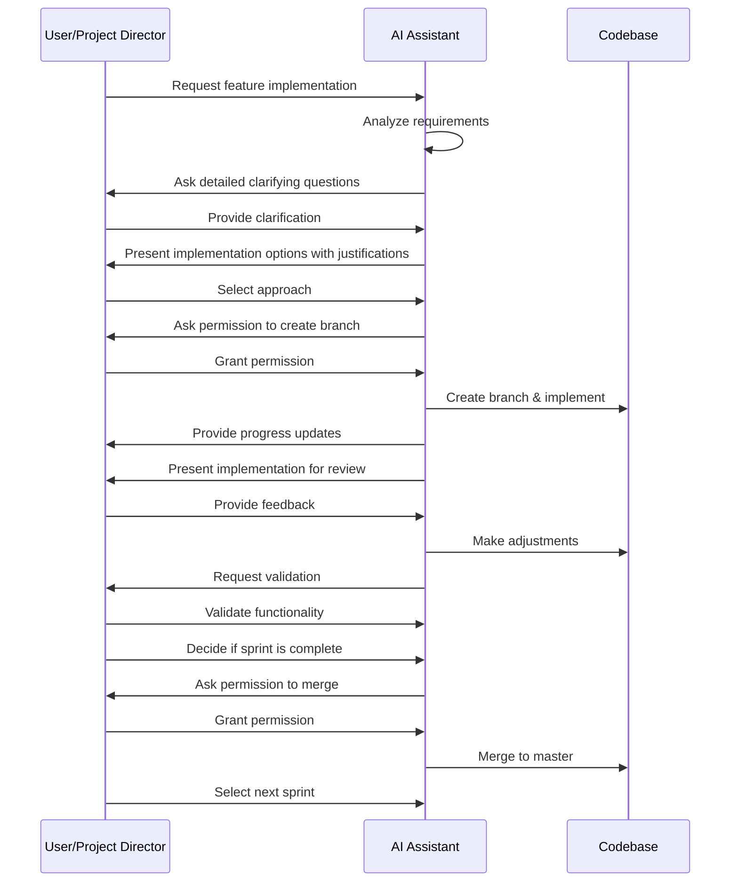
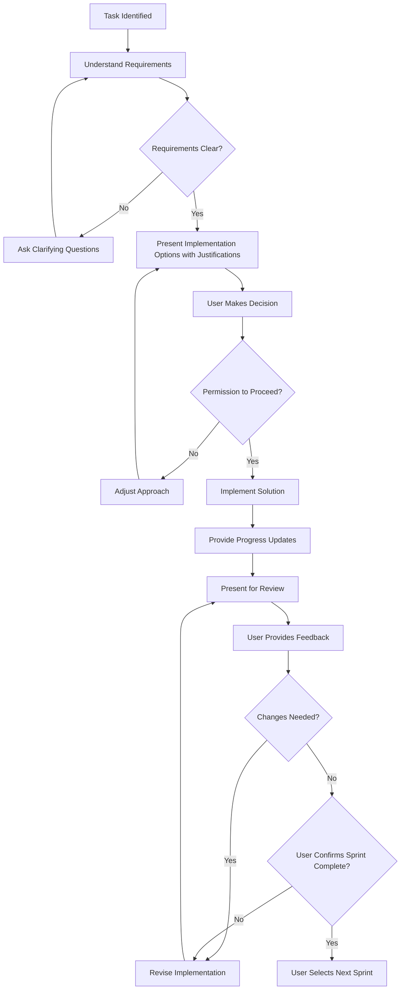
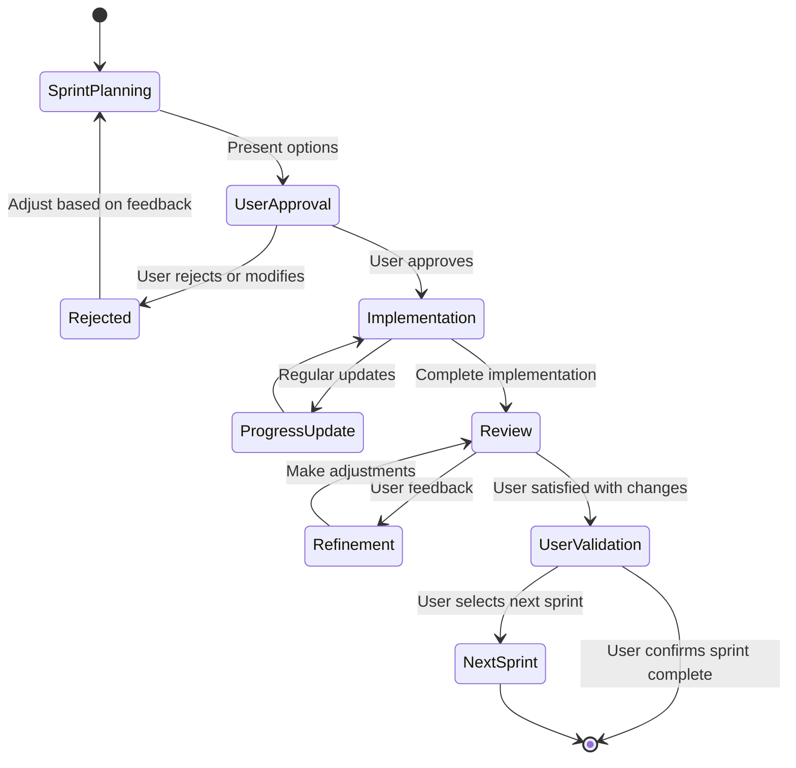
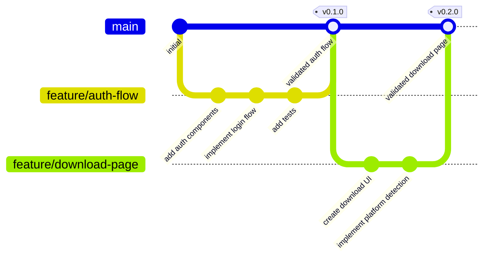
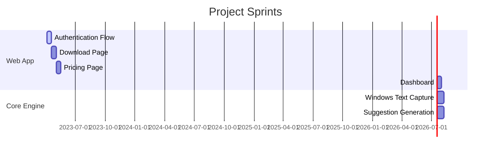

# System Patterns

## Architecture Overview

## Core Components

### Autocomplete Client Architecture

### Cloud Backend Architecture

## Collaboration Patterns

### Project Direction Flow

### Development Communication Flow

### Decision-Making Framework

## Development Workflow

### Sprint Lifecycle

### Git Branching Strategy

### Sprint-Based Development

## Design Patterns

### Client-Side Patterns
- **Observer Pattern**: For monitoring text input fields and triggering suggestions
- **Strategy Pattern**: For switching between different autocomplete modes
- **Repository Pattern**: For abstracting data access and synchronization
- **Factory Pattern**: For creating platform-specific components

### Web Application Patterns
- **Component-Based Architecture**: React/Next.js components for UI
- **Container/Presenter Pattern**: Separation of data handling and presentation
- **Server-Side Rendering**: For improved performance and SEO
- **API Route Handlers**: For secure server-side operations

### Data Flow Patterns
- **Event-Sourcing**: For tracking and synchronizing user context changes
- **CQRS**: Separate query and command models for data operations
- **Optimistic Updates**: For responsive UI during cloud synchronization

## Key Interfaces

### Core Engine API
- `initialize(config: EngineConfig): void`
- `suggest(context: TextContext): Suggestion[]`
- `learn(context: TextContext, selection: Selection): void`
- `setMode(mode: AutocompleteMode): void`
- `sync(): Promise<SyncResult>`

### Platform-Specific Module Interface
- `captureTextContext(): TextContext`
- `injectSuggestion(suggestion: Suggestion): void`
- `registerHotkeys(config: HotkeyConfig): void`
- `monitorTextFields(): void`

### Cloud Sync Interface
- `pushContext(context: UserContext): Promise<SyncResult>`
- `pullContext(): Promise<UserContext>`
- `authenticate(credentials: AuthCredentials): Promise<AuthResult>`
- `syncPreferences(preferences: UserPreferences): Promise<SyncResult>` 